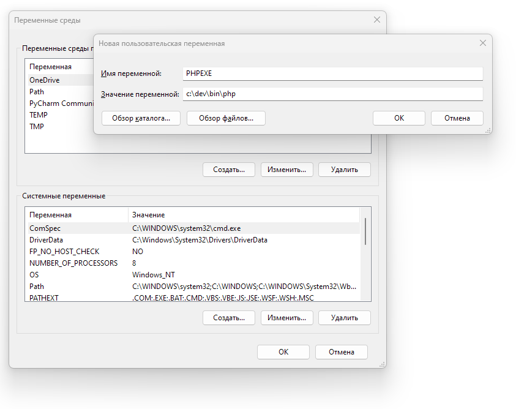

# markdown-book

Веб-интерфейс на PHP для работы с текстовой базой данных в формате MarkDown.

## Установка и запуск

Проект функционирует от встроенного php-сервера. Для работы необходимо создать переменную окружения ``PHPEXE``, в которой указать путь к файлу ``php.exe``:



Запуск сервера проиводится через командный файл в корневой папке с указанием пути к каталогу wiki в виде параметра:

```dos
buildin-server-run.cmd C:\Users\user1\MyDocuments\MD-Wiki
```

